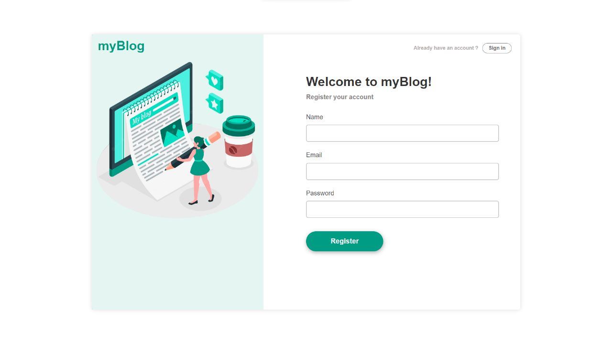
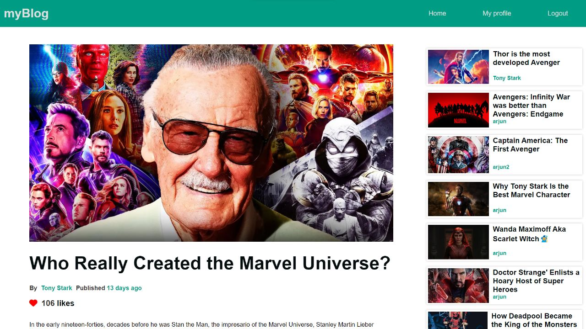

## Blogging-Website

### Install dependencies
```console 
npm install
```
### Start
```console
node src/App.js
```
```sh
The Website will be available at http://localhost:3000
```
 **Screenshots**: 

<h3 align="center"> Login section</h3>

<h3 align="center"> Home Page</h3>

<h3 align="center"> Post View</h3>

<h3 align="center"> Profile Section</h3>

<h3 align="center"> Admin Dashboard </h3>


